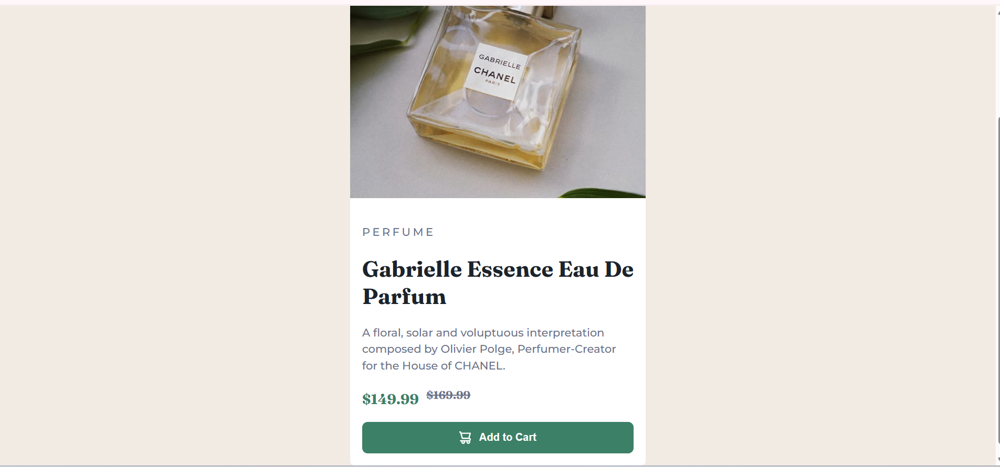

# Frontend Mentor - Product preview card component solution

This is a solution to the Product preview card component challenge on Frontend Mentor(https://www.frontendmentor.io/challenges/product-preview-card-component-GO7UmttRfa). Frontend Mentor challenges help you improve your coding skills by building realistic projects. 

## Table of contents

- [Overview](#overview)
  - [The challenge](#the-challenge)
  - [Screenshot](#screenshot)
  - [Links](#links)
- [My process](#my-process)
  - [Built with](#built-with)
  - [What I learned](#what-i-learned)
  - [Continued development](#continued-development)
  - [Useful resources](#useful-resources)
  - [AI Collaboration](#ai-collaboration)
- [Author](#author)
- [Acknowledgments](#acknowledgments)

**Note: Delete this note and update the table of contents based on what sections you keep.**

## Overview

### The challenge

Users should be able to:

- View the optimal layout depending on their device's screen size
- See hover and focus states for interactive elements

### Screenshot




### Links

- Solution URL: (https://github.com/vault-codes/product-preview-card-component-main)

- Live Site URL: (https://prokject0.netlify.app/)

## My process

### Built with

- Semantic HTML5 markup
- CSS custom properties
- Flexbox
- CSS Grid
- Mobile-first workflow


### What I learned

i learned how to implement responsive desktop breakpoint styling. and i was able to see the smooth transition of the containers element from column layout to row layout using flex property across various user screen sizes

To see how you can add code snippets, see below:

```html
<main class="container"> 

  

  </main>
```
```@media (min-width: 768px){

    .container{
        max-width:  50rem;

        font-size: 1rem;

        margin-top: 5vh;

        display: flex;

        align-items: center;

    }

        
    }

```


### Continued development

i will try focusing on understanding  how to also implement responsive desktop breakpointing on other design styles 


## Author

- Website - [Prime Craft Team](https://prokject0.netlify.app/)
- Frontend Mentor - [@vaultcodes](https://www.frontendmentor.io/profile/vault-codes)


